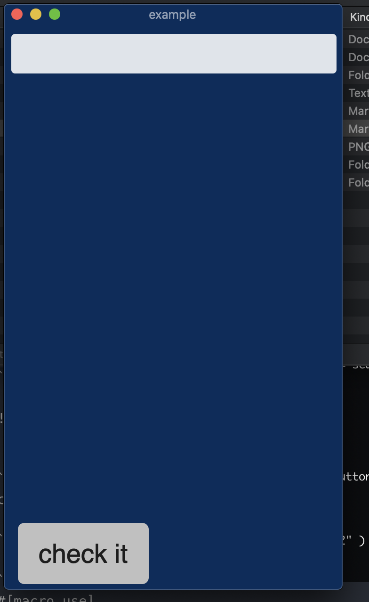

# r-ui

#### doc
a rust  desktop Gui  based on web_view.

#### mvc

#### install

```rs
[dependencies]
search-ui = {git = "https://gitee.com/dark.H/r-ui.git"}
```

#### usage

> a verify simple code
```rs
extern crate search_ui;
fn main() {
    search_ui::with_search(|tp, id, content|{
        println!("input text : {}, {}, {}", tp, id , content);
    });
}
```

```bash
cargo run --examples hello
```


```bash
cargo run --examples hello2

```




```rs
#[macro_use]
extern crate search_ui;
use search_ui::UI;


fn main(){
    let mut h = with_html!{
        (B "check it")
        @css
        button#check-it{
            position: absolute;
            bottom: 1%;
        }

        input{
            position: absolute;
            top: 1%;
        }
        @js
        document.getElementById("check-it").addEventListener("click", function(){
            alert("hello 2")
        });
    };
    
    search_ui::with_search_extend(|tp, id, content|{
        println!("rpc handle here : {} {} {} ", tp, id ,content);
    }, &h);
    
}
```

#### author

qingluan


